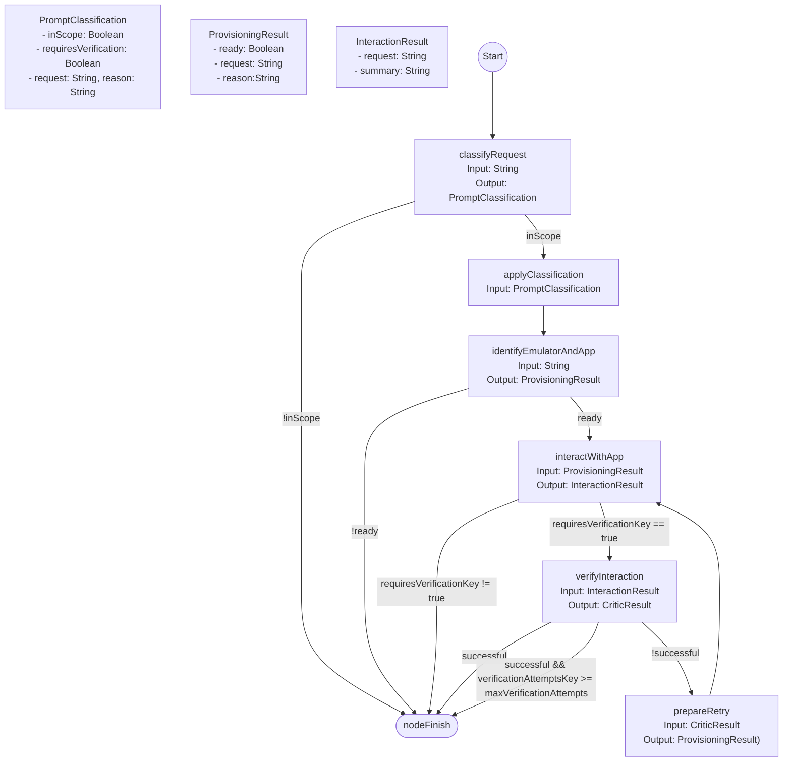

OneShotDeviceInteractionStrategy — Nodes, Inputs, Outputs, and Edge Conditions

This document visualizes the node graph, inputs/outputs, and edge conditions for OneShotDeviceInteractionStrategy.kt

Legend
- nodeFinish: finalizing node that returns a user-facing string (transformed messages shown on finishing edges)
- Storage keys used (exact keys):
  - verificationAttemptsKey -> createStorageKey<Int>("verification-attempts") (counts verification retries)
  - requiresVerificationKey -> createStorageKey<Boolean>("requires-verification") (whether layer 3 should run)
- maxVerificationAttempts = 3 (constant in strategy)

Edge evaluation order notes
- Edges are evaluated in the order they are defined: classifier's "out of scope" finish edge is checked before the "inScope" path; verification checks successful/attempts before the generic retry.

Quick node summary
- classifyRequest: gate/scope check (no tools). Produces PromptClassification (inScope, requiresVerification, request, reason).
- applyClassification: persists requiresVerification (uses ClassificationStorage.storeClassificationInfoTask) and forwards the original request.
- identifyEmulatorAndApp: prepares target emulator/device and app using DeviceManagerTools.asTools(); yields ProvisioningResult.ready or fail.
- interactWithApp: executes INTERACTION steps using UiHierarchyTools.asTools() + UiInteractionTools.asTools(); returns InteractionResult.summary.
- verifyInteraction: built-in critic that validates UI state using UiHierarchyTools; returns CriticResult(successful, input, feedback).
- prepareRetry: bumps verificationAttemptsKey and converts CriticResult feedback into a new ProvisioningResult so the interaction node can re-run with feedback.

Storage & Looping
- On failed verification and attempts < maxVerificationAttempts, flow loops: verifyInteraction -> prepareRetry -> interactWithApp -> verifyInteraction
- On success or exhausted attempts, flow ends at nodeFinish with a transformed message.
