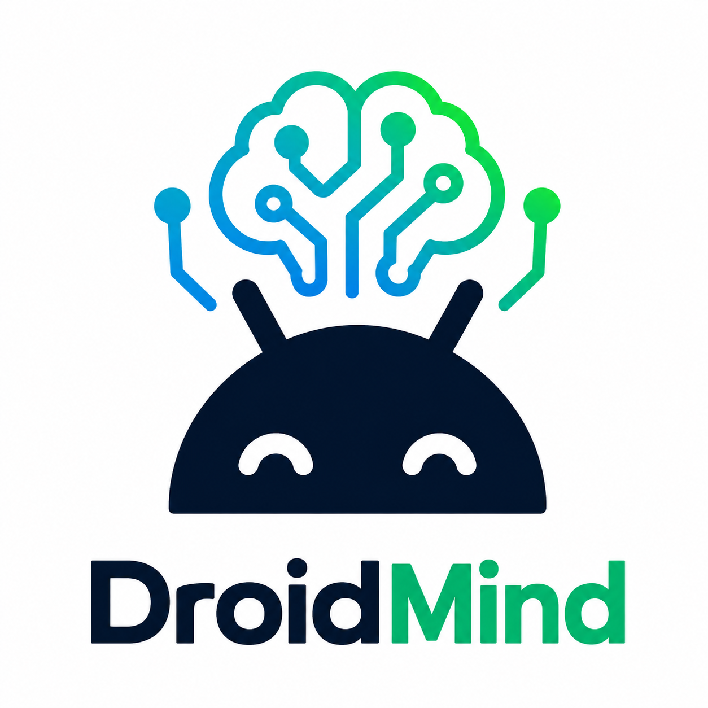

# DroidMind



A playful AI for Android automation — turn plain language into device actions.

<div align="center">
  <video src="https://github.com/user-attachments/assets/97d3cde7-6b9b-43f6-bebf-487d2d618782" width="45%" controls></video>
  <video src="https://github.com/user-attachments/assets/e449050a-60f6-4399-8212-e2f8554f5a59" width="45%" controls></video>
  <p><em>Manual amount entry and quick amount selection.</em></p>
</div>

## Why DroidMind?

Give commands like "search YouTube for X and open the first result" and DroidMind interprets, executes via ADB, verifies
results, and reports back. Great for demos, test automation, and exploring LLM-driven device control.

## Highlights

- Natural-language → device actions (LLM-driven)
- ADB-based device & emulator control
- UI layout analysis for element-finding and verification
- Modular, Koin-based DI and Kotlin Multiplatform codebase
- ACP (Agent Client Protocol) support for extensibility

## Quick start

### Configuration:

On first run the app will create a default configuration file. Location by OS:

- Linux: $HOME/.config/DroidMind/config.json
- macOS: $HOME/Library/Application Support/DroidMind/config.json
- Windows: %APPDATA%/DroidMind/config.json

The generated __config.json__ contains an "api.keys" section (gemini, ollama) and an "agent.providers" map. Add your API
keys or provider entries to enable remote/local agents. Currently supported providers: Gemini and Ollama by default.

```json
{
  "app": {
    "name": "droidmind",
    "version": "0.0.1"
  },
  "env": {
    "_comment": "Environment variables for the app (supports env vars: \"${ENV_VAR_NAME}\")",
    "ANDROID_HOME": "${ENV_VAR_NAME}"
  },
  "api": {
    "keys": {
      "_comment": "Add your API keys here (supports env vars: \"${ENV_VAR_NAME}\")",
      "gemini": "${GEMINI_API_KEY}",
      "ollama": ""
    }
  },
  "agent": {
    "providers": {
      "google": {
        "maxIterations": 250,
        "temperature": 0.2,
        "baseUrl": ""
      },
      "ollama": {
        "maxIterations": 100,
        "temperature": 0.7,
        "baseUrl": "http://localhost:11434"
      }
    }
  }
}
```

### Build the project:

```bash
./gradlew build
```

### Run the desktop app (Compose UI):

```bash
ANDROID_HOME={ANDROID_SDK_PATH} ./gradlew composeApp:run
```

### Build the ACP executable and configure your `acp.json:

```bash
./gradlew :acp-starter:clean :acp-starter:installDist
```

```json
{
  "agent_servers": {
    "DroidMind Agent": {
      "command": "{PROJECT_BUILD_DIRECTORY}/install/acp-starter/bin/acp-starter",
      "args": [],
      "env": {
        "ANDROID_HOME": "{ANDROID_SDK_PATH}",
        "GEMINI_API_KEY": "API_KEY"
      }
    }
  }
}
```

Even though set __ANDROID_HOME__ in the [config.json](#configuration), you have to also set it in your shell
environment. This will be fixed in the future.

## Example scenario

"***Open the "AI Money Transfer" app and transfer 10 pounds to the account 00-00-01 12985684. Verify that the transfer
is successful.***" — the agent will plan steps, interact with the device UI, and verify results.

### Agent strategies

- __SteppedDeviceInteractionStrategy__ (Enabled by default) — preferred for structured multi-step plans.
  See [the strategy diagram](STEPPED_DEVICE_INTERACTION_STRATEGY.md), flow notes, storage keys, and edge behaviors.
- __OneShotDeviceInteractionStrategy__ — single-pass request → interact → optional verify flow.
  See [the strategy diagram](ONE_SHOT_DEVICE_INTERACTION_STRATEGY.md), flow notes, storage keys, and edge behaviors.

## Contributing

Contributions welcome! Open issues or PRs. Follow module structure and DI conventions in the repo. Add tests for new
tools or device actions.

## Security & Safety

This project can run ADB commands automatically. Use only on trusted devices or emulators. Review and test strategies
before running on production devices.

## License

Apache 2.0 — see [LICENSE](LICENSE).
