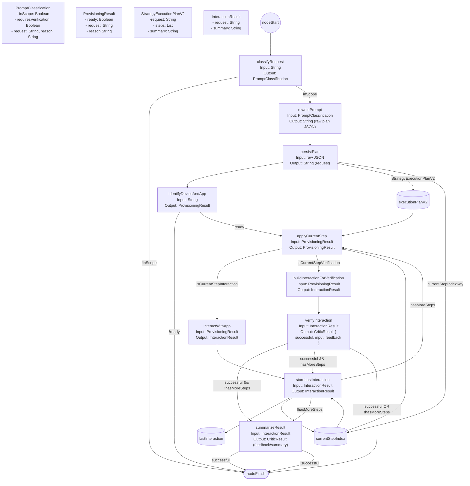

SteppedDeviceInteractionStrategy — Nodes, Inputs, Outputs, and Edge Conditions

This document visualizes the node graph, inputs/outputs, and edge conditions for SteppedDeviceInteractionStrategy.kt

Legend & Behavior Notes
- Plan formats: Supports StrategyExecutionPlanV2 (preferred): ordered steps with types INTERACTION or VERIFICATION. persistPlan stores the parsed StrategyExecutionPlanV2 into executionPlanV2 storage and initializes currentStepIndex = 0.
- Storage keys used:
  - executionPlanV2 (executionPlanV2Key)
  - currentStepIndex (currentStepIndexKey)
  - lastInteraction (lastInteractionKey)
  - verificationAttemptsKey
  - requiresVerificationKey
  - maxVerificationAttempts = 3
- applyCurrentStep behavior: reads executionPlanV2 and currentStepIndex from storage; when a step exists its content replaces the ProvisioningResult.request so downstream nodes act on the step.content.
- Interaction step flow: interactWithApp -> storeLastInteraction. storeLastInteraction persists lastInteraction and increments currentStepIndex. After storing, if hasMoreSteps -> applyCurrentStep (next step); otherwise -> summarizeResult -> finish.
- Verification step flow: buildInteractionForVerification -> verifyInteraction. On success:
  - if hasMoreSteps -> verify result is transformed into an InteractionResult (feedback used as summary) and forwarded to storeLastInteraction, advancing the plan; loop continues.
  - if no more steps -> summarizeResult -> finish (final summary returned).
- Failure path: when verifyInteraction reports unsuccessful, the current strategy finalizes and returns a failure/"gave up" message. The code contains handleVerificationFailure (backtracking to a previous INTERACTION) but edges connecting it are currently commented out.
- Edge evaluation and storage timing: storeLastInteraction increments currentStepIndex as a side-effect before branch checks; edge ordering matters for correct progression.

Quick node summary
- classifyRequest: scope gate (no tools). Produces PromptClassification (inScope, requiresVerification, request, reason).
- rewritePrompt: rewrites request into machine-readable plan JSON (no tools). persistPlan parses and stores the plan.
- identifyDeviceAndApp: prepares target device/app (DeviceManagerTools). Produces ProvisioningResult(ready, request, reason).
- applyCurrentStep: injects current step.content into the provisioning request.
- interactWithApp: executes INTERACTION steps using UiHierarchyTools + UiInteractionTools, returns InteractionResult(request, summary).
- buildInteractionForVerification: builds an InteractionResult for VERIFICATION steps (uses lastInteraction if present).
- verifyInteraction: built-in critic that validates UI state, returns CriticResult(successful, input, feedback).
- storeLastInteraction: persists lastInteraction JSON and advances currentStepIndex.
- summarizeResult: final summarizer (toolless critic) that returns a user-facing summary.

Looping & Retry
- Normal progression: persistPlan (currentStepIndex=0) -> applyCurrentStep -> (INTERACTION) interactWithApp -> storeLastInteraction (index++) -> applyCurrentStep -> ... until no steps remain, then summarizeResult -> finish.
- Verification steps consume no new interaction; they validate current UI using lastInteraction context. Successful verification either advances the plan or leads to final summarization. Unsuccessful verification currently ends the run with a failure message.
- Note: handleVerificationFailure is implemented to backtrack to the nearest prior INTERACTION and retry, but the strategy does not wire it into the active edges (commented-out). Re-enabling it would allow bounded retry behavior using verificationAttemptsKey and maxVerificationAttempts.
